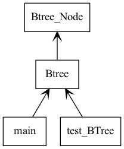
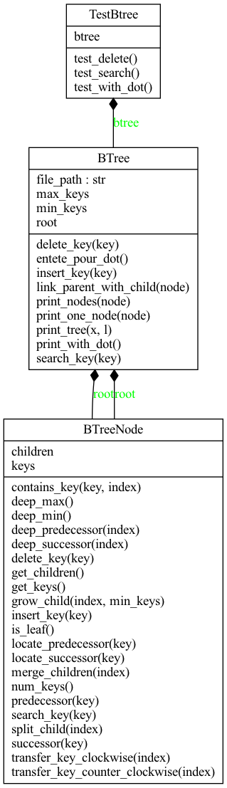
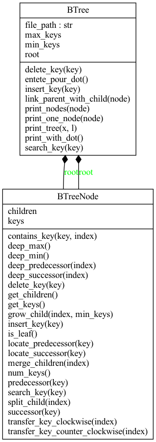
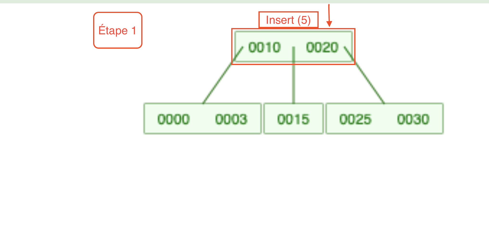
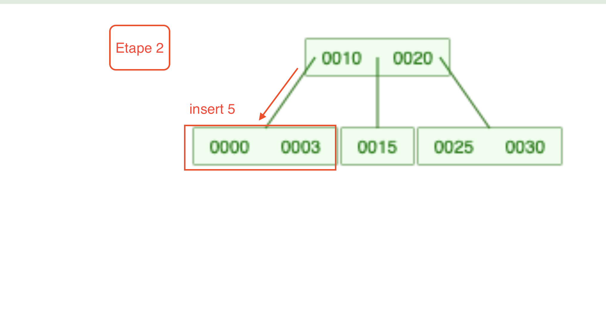
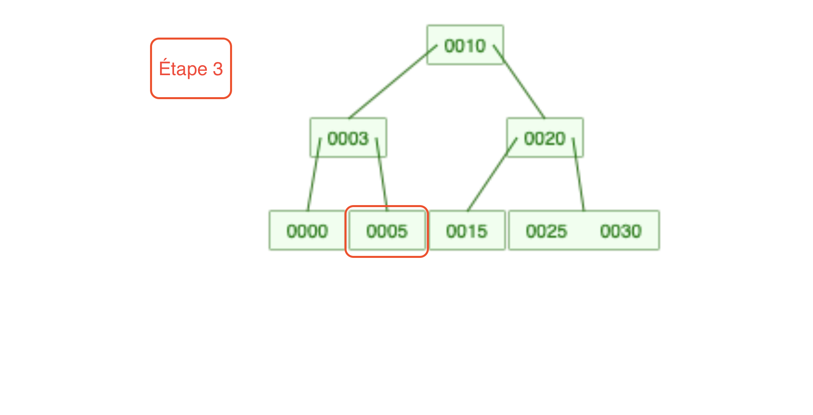
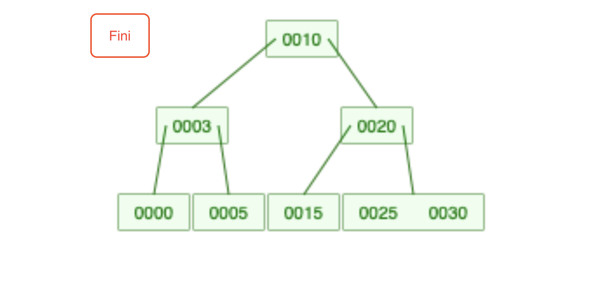

# TP_Projet_L3S6_TRAORE 

# Author:
    - Adama TRAORE

# Sujet

B_Tree

## Usage

Pour executer le programme : 
1. on ouvre le `terminal`
2. on se place dans le dossier  `src` de la racine du projet où sont définies toutes nos classes 

```console
$ cd tp_projet_l3s6_sharfeldin_traore/src
```
3. on execute les commandes :

```console
$ python3 Btree_Node.py
```

```console
$ python3 Btree.py
```

```console
$ python3 test_BTree.py
```

```console
$ python3 main.py
```

4. pour l'affichage de l'arbre, aprés avoir executé `python3 main.py` , on écrit directement dans le terminal la commande:
   
```console
$ dot -Txlib tree.dot
```

## UML

**UML Packages and classes**
<table>
<tr>
<td>
<h1>Packages</h1>

</td>
<td>
<h1>UML</h1>

</td>
<td>
<h1>classes</h1>

</td>
</tr>
</table>


## Fonction d' insertion

### Explication générale
Dans notre algorithme nous avons choisi le nombre de degré (d) de tel sorte qu'il soit superieur à 1.
pour nous permettre d'avoir une clé  comprise entre  Umin <= k <= Umax, la clé minimale Umin= d-1 et la clé maximale Umax = 2*d-1.

**Notre algorithme présente  deux cas de figure :**
- N est un noeud avec des enfants:
   Nous chercherons où L (clé à insérer ) appartient dans le tableau de clés, si la valeur de L est inferieure à la valeur de N décalons vers la gauche et refait la recherche (recursivement) Nous trouvons un enfant de N où nous pouvons (récursivement) insérer L. Si cet enfant est complet, nous le divisons et déterminons à qui appartient L. Sinon décalons tout vers la droite refait la recherche (recursivement) Nous trouvons un enfant de N où nous pouvons (récursivement) insérer L. Si cet enfant est complet, nous le divisons et déterminons à qui appartient L.
    

- N est  un noeud sans enfants :
     Nous  pouvons (récursivement) inserer la clé  au noeud à ce que ça respecte l'ordre croissant des nombres. parce qu'il n'a pas d'enfants  si la valeur maximale de clé est atteinte au niveau du noeud nous le divisons (récursivement). pour avoir des enfants (récursivement) Si  l'enfant  auquel L doit etre inserer est complet, nous le divisons et déterminons à qui appartient L.
   

### Exemple de la insertion

**Etape 1**
<table>
<tr>
<td>

</td>
<td>


```py
def insert_key(self, key):
    """
    Inserts key in the b-tree.
    """
     
    if self.root.num_keys() == self.max_keys:
        # si la liste est vide donc on l'insere
        #  à la racine 
        self.root = BTreeNode([], [self.root])
        self.root.split_child(0)
    node = self.root
    while not node.is_leaf():
        index = node.search_key(key)
        child = node.children[index]
        if child.num_keys() == self.max_keys:
            node.split_child(index)

            if node.keys[index] < key:
                index += 1
        node = node.children[index] 
    node.insert_key(key)

```

</td>
</tr>
</table>

**Etape 2**
<table>
<tr>
<td>

</td>
<td>

```py
def insert_key(self, key):
    """
    Inserts key in the b-tree.
    """
     
    if self.root.num_keys() == self.max_keys:
        # si la liste est vide donc on l'insere
        #  à la racine  
        self.root = BTreeNode([], [self.root])
        self.root.split_child(0)
    node = self.root
    # tant que le nœud n'est pas une feuille
    while not node.is_leaf():
        # 5 est infèrieur a la plus petite 
        # valeur du nœud qui est  10
        # donc décalons vers la gauche
        index = node.search_key(key)
        child = node.children[index]
        if child.num_keys() == self.max_keys:
            node.split_child(index)

            if node.keys[index] < key:
                index += 1
        node = node.children[index] 
    node.insert_key(key)
```

</td>
</tr>
</table>

**Etape 3**
<table>
<tr>
<td>

</td>
<td>

```py
def insert_key(self, key):
    """
    Inserts key in the b-tree.
    """
    if self.root.num_keys() == self.max_keys:
        # si la liste est vide donc on l'insere 
        # à la racine  
        self.root = BTreeNode([], [self.root])
        self.root.split_child(0)
    node = self.root
    # tant que le nœud n'est pas une feuille
    while not node.is_leaf():
        # 5 est infèrieure a la plus petite 
        # valeur du nœud qui est 10
        # donc décalons vers la gauche
        # comparons 5 avec les valeurs du 
        # noeud enfant gauche 5 est plus grande
        #  que toutes les valeurs donc il
        #  va se mettre aprés le 3 
        # puis que le nombre maximal de clé est
        #  fixé à 2 donc il va provoquer un 
        # eclatement et le 3 devient le parent 
        index = node.search_key(key)
        child = node.children[index]
        if child.num_keys() == self.max_keys:
            node.split_child(index)

            if node.keys[index] < key:
                index += 1
        node = node.children[index] 
    node.insert_key(key)


```

</td>
</tr>
</table>

**Etape 4**
<table>
<tr>
<td>

</td>
<td>

```py
def insert_key(self, key):
    """
    Inserts key in the b-tree.
    """
    # si la liste est vide donc on l'insere à la racine  
    self.root = BTreeNode([], [self.root])
    self.root.split_child(0)
    node = self.root
    # tant que le nœud n'est pas une feuille
    while not node.is_leaf():
        # 5 est infèrieure a la plus petite 
        # valeur du nœud qui est 10
        # donc décalons vers la gauche
        # comparons 5 avec les valeurs du 
        # noeud enfant gauche 
        # 5 est plus grande que toutes les 
        # valeurs donc il va se mettre aprés le 3 
        # puis que le nombre maximal de clé est
        #  fixé à 2 donc il va provoquer un 
        # eclatement et le 3 devient le parent 
        index = node.search_key(key)
        child = node.children[index]
        if child.num_keys() == self.max_keys:
            node.split_child(index)

            if node.keys[index] < key:
                index += 1
        node = node.children[index]
    # alors l'insertion de 5 a eu lieu
    # il est un enfant droit de 3
    node.insert_key(key)
```

</td>
</tr>
</table>


## Fonction de recherche

### Explication générale
pour l'algorithme de recherche Btree on a deux cas de figure:
- le cas où l'arbre est vide retourne None.
- le cas où l'arbre n'est pas vide  
     on compare la valeur de la clé à inserer avec les valeurs de la racine, si la valeur  à inserer est plus grande que les valeurs de la racine on cherche (recursivement) à droite sinon on cherche (recursivement) à gauche  et on retourne la valeur recherchée.

### Exemple de la recherche

**Etape 1**
<table>
<tr>
<td>

</td>
<td>

```py
def search_key(self, key):
        """
        Returns an empty b-tree with the given degree.
        Note: Assumes degree > 1.
        """
        # à partir de la racine on cherche 25
        (node, index) = self.root, self.root.search_key(key)
        while not node.contains_key_at(key, index) and not node.is_leaf():
            # la valeur 25 n'est pas égale à 10 et aussi le 10 n'est pas
            #  une feuille
            node = node.children[index]
            index = node.search_key(key)

        return (node, index) if node.contains_key_at(key, index) else None
```

</td>
</tr>
</table>

**Etape 2**
<table>
<tr>
<td>

</td>
<td>

```py
def search_key(self, key):
        """
        Returns an empty b-tree with the given degree.
        Note: Assumes degree > 1.
        """
        # à partir de la racine on cherche 25
        (node, index) = self.root, self.root.search_key(key)
        while not node.contains_key_at(key, index) and not node.is_leaf():
            # la valeur 25 n'est pas égale à 10 et aussi le 10 n'est pas 
            # une feuille
            node = node.children[index]
            # on compare 25 à 10 on voit que 25 > 10
            # donc search_key(25) va s'orienter vers la droite.
            index = node.search_key(key)

        return (node, index) if node.contains_key_at(key, index) else None
```

</td>
</tr>
</table>

**Etape 3**
<table>
<tr>
<td>

</td>
<td>

```py
def search_key(self, key):
        """
        Returns an empty b-tree with the given degree.
        Note: Assumes degree > 1.
        """
        # à partir de la racine on cherche 25
        (node, index) = self.root, self.root.search_key(key)
        while not node.contains_key_at(key, index) and not node.is_leaf():
            # la valeur 25 n'est pas égale à 10 et aussi le 10 n'est pas
            #  une feuille
            node = node.children[index]
            # on compare 25 à 10 on voit que 25 > 10
            # donc search_key(25) va s'orienter vers la droite.
            # on compare 25 à 20 on voit que 25 > 20
            # donc search_key(25) va s'orienter vers la droite.
            # on est face à une feuille contenant la valeur 25 trouvée
            index = node.search_key(key)

        return (node, index) if node.contains_key_at(key, index) else None

```

</td>
</tr>
</table>

**Etape 4**
<table>
<tr>
<td>

</td>
<td>

```py
def search_key(self, key):
        """
        Returns an empty b-tree with the given degree.
        Note: Assumes degree > 1.
        """
        (node, index) = self.root, self.root.search_key(key)
        while not node.contains_key_at(key, index) and not node.is_leaf():
    
            node = node.children[index]
         
            index = node.search_key(key)
        # on retourne la valeur 25 trouvée
        return (node, index) if node.contains_key_at(key, index) else None

```

</td>
</tr>
</table>

**Etape 5**
<table>
<tr>
<td>

</td>
<td>

```py
def search_key(self, key):
        """
        Returns an empty b-tree with the given degree.
        Note: Assumes degree > 1.
        """
        (node, index) = self.root, self.root.search_key(key)
        while not node.contains_key_at(key, index) and not node.is_leaf():
    
            node = node.children[index]
         
            index = node.search_key(key)
        # on retourne la valeur 25 trouvée
        return (node, index) if node.contains_key_at(key, index) else None


```

</td>
</tr>
</table>

## Fonction de suppression

### Explication générale

* On doit d’abord chercher la clé à supprimer, et la supprimer du nœud qui la contient.

Si le nœud est interne, on procède de manière similaire aux arbres binaires de recherche en recherchant la clé k la plus à gauche dans le sous-arbre droit de la clé à supprimer ou la plus à droite dans le sous-arbre gauche. Cette clé k appartient à une feuille. On peut la permuter avec la clé à supprimer, que l’on supprime ensuite. Comme elle appartient à une feuille, on se ramène au cas suivant.
Si le nœud est une feuille, soit il possède encore suffisamment de clés et l’algorithme termine, soit il dispose de moins de L−1 clés et on se trouve dans l’une des deux situations suivantes :
soit un de ses frères à droite ou à gauche possède suffisamment de clés pour pouvoir en "passer" une à la feuille en question : dans ce cas cette clé remplace la clé qui sépare les deux sous-arbres dans l’arbre père, qui va elle même dans la feuille en question ;
soit aucun de ses frères n’a suffisamment de clés : dans ce cas, le père fait passer une de ses clés dans un des deux (ou le seul) frères pour permettre à la feuille de fusionner avec celui-ci. Ceci peut cependant conduire le père à ne plus avoir suffisamment de clés. On réitère alors l’algorithme : si le nœud a un frère avec suffisamment de clés, la clé la plus proche va être échangée avec la clé du père, puis la clé du père et ses nouveaux descendants sont ramenés dans le nœud qui a besoin d’une clé ; sinon on effectue une fusion à l’aide d’une clé du père et ainsi de suite. Si l’on arrive à la racine et qu’elle possède moins de L éléments, on fusionne ses deux fils pour donner une nouvelle racine.
### Exemple de la suppression

1ere cas : suppression de l'element d'un nœud.

**Etape 1**
<table>
<tr>
<td>

</td>
<td>

```py
def delete_key(self, key):
        """
        Deletes key from the b-tree.
        """
        # suppression du 9
        
        node = self.root
        # on verifie si 9 n'est pas une feuille
        while not node.is_leaf():
            # on cherche la clé 9
            index = node.search_key(key)
            # on voit que le noeud contient la clé
            if node.contains_key(key, index):
                left, right = node.children[index : index+2]

                if left.num_keys() > self.min_keys:
                    node.keys[index] = node.deep_predecessor(index)
                    (node, key) = (left, node.keys[index])

                elif right.num_keys() > self.min_keys:
                    node.keys[index] = node.deep_successor(index) 
                    (node, key) = (right, node.keys[index])

                else:
                    node = node.merge_children(index)

            else:
                child = node.children[index]
                if child.num_keys() <= self.min_keys:
                   child = node.grow_child(index, self.min_keys)
                node = child
                    
        node.delete_key(key)

```

</td>
</tr>
</table>

**Etape 2**
<table>
<tr>
<td>

</td>
<td>

```py
def delete_key(self, key):
        """
        Deletes key from the b-tree.
        """
        # suppression du 9
        
        node = self.root
        # on verifie si 9 n'est pas une feuille
        while not node.is_leaf():
            # on cherche la clé 9
            index = node.search_key(key)
            # on voit que le noeud contient la clé
            if node.contains_key(key, index):
                left, right = node.children[index : index+2]
                # on cherche la profondeur maximale de la partie gauche
                if left.num_keys() > self.min_keys:
                    node.keys[index] = node.deep_predecessor(index)
                    (node, key) = (left, node.keys[index])

                elif right.num_keys() > self.min_keys:
                    node.keys[index] = node.deep_successor(index) 
                    (node, key) = (right, node.keys[index])

                else:
                    node = node.merge_children(index)

            else:
                child = node.children[index]
                if child.num_keys() <= self.min_keys:
                   child = node.grow_child(index, self.min_keys)
                node = child
                    
        node.delete_key(key)

```

</td>
</tr>
</table>

**Etape 3**
<table>
<tr>
<td>

</td>
<td>

```py
def delete_key(self, key):
        """
        Deletes key from the b-tree.
        """
        # suppression du 9
        
        node = self.root
        # on verifie si 9 n'est pas une feuille
        while not node.is_leaf():
            # on cherche la clé 9
            index = node.search_key(key)
            # on voit que le noeud contient la clé
            if node.contains_key(key, index):
                left, right = node.children[index : index+2]
                # on cherche la profondeur maximale de la 
                # partie gauche
                # on voit que la clé 5 n'est pas la profondeur 
                # maximale on passe à la clé 8
                # on voit que la clé 8 est la maximale
                if left.num_keys() > self.min_keys:
                    node.keys[index] = node.deep_predecessor(index)
                    (node, key) = (left, node.keys[index])

                elif right.num_keys() > self.min_keys:
                    node.keys[index] = node.deep_successor(index) 
                    (node, key) = (right, node.keys[index])

                else:
                    # on fusionne la clé 8 à la place de 9
                    node = node.merge_children(index)

            else:
                child = node.children[index]
                if child.num_keys() <= self.min_keys:
                   child = node.grow_child(index, self.min_keys)
                node = child
        # on supprime la clé 9
        node.delete_key(key)

```

</td>
</tr>
</table>

**Etape 4**
<table>
<tr>
<td>

</td>
<td>

```py
def delete_key(self, key):
        """
        Deletes key from the b-tree.
        """
        # suppression du 9
        
        node = self.root
        # on verifie si 9 n'est pas une feuille
        while not node.is_leaf():
            # on cherche la clé 9
            index = node.search_key(key)
            # on voit que le noeud contient la clé
            if node.contains_key(key, index):
                left, right = node.children[index : index+2]
                # on cherche la profondeur maximale de la partie 
                # gauche
                # on voit que la clé 5 n'est pas la profondeur 
                # maximale on passe à la clé 8
                # on voit que la clé 8 est la maximale
                if left.num_keys() > self.min_keys:
                    node.keys[index] = node.deep_predecessor(index)
                    (node, key) = (left, node.keys[index])

                elif right.num_keys() > self.min_keys:
                    node.keys[index] = node.deep_successor(index) 
                    (node, key) = (right, node.keys[index])

                else:
                    # on deplace la clé 8 à la place de 9
                    # on deplace la clé 5 à la place de 8
                    node = node.merge_children(index)

            else:
                child = node.children[index]
                if child.num_keys() <= self.min_keys:
                   child = node.grow_child(index, self.min_keys)
                node = child
        # on supprime la clé 9
        node.delete_key(key)
```

</td>
</tr>
</table>

**Etape 5**
<table>
<tr>
<td>

</td>
<td>

```py
def delete_key(self, key):
        """
        Deletes key from the b-tree.
        """
        # suppression du 9
        
        node = self.root
        # on verifie si 9 n'est pas une feuille
        while not node.is_leaf():
            # on cherche la clé 9
            index = node.search_key(key)
            # on voit que le noeud contient la clé
            if node.contains_key(key, index):
                left, right = node.children[index : index+2]
                # on cherche la profondeur maximale de la partie
                #  gauche
                # on voit que la clé 5 n'est pas 
                # la profondeur maximale on passe à la clé 8
                # on voit que la clé 8 est la maximale
                if left.num_keys() > self.min_keys:
                    node.keys[index] = node.deep_predecessor(index)
                    (node, key) = (left, node.keys[index])

                elif right.num_keys() > self.min_keys:
                    node.keys[index] = node.deep_successor(index) 
                    (node, key) = (right, node.keys[index])

                else:
                    # on deplace la clé 8 à la place de 9
                    # on deplace la clé 5 à la place de 8
                    node = node.merge_children(index)

            else:
                child = node.children[index]
                if child.num_keys() <= self.min_keys:
                   child = node.grow_child(index, self.min_keys)
                node = child
        # on supprime la clé 9
        node.delete_key(key)


```

</td>
</tr>
</table>

**Etape 6**
<table>
<tr>
<td>

</td>
<td>

```py
def delete_key(self, key):
        """
        Deletes key from the b-tree.
        """
        # suppression du 9
        
        node = self.root
        # on verifie si 9 n'est pas une feuille
        while not node.is_leaf():
            # on cherche la clé 9
            index = node.search_key(key)
            # on voit que le noeud contient la clé
            if node.contains_key(key, index):
                left, right = node.children[index : index+2]
                # on cherche la profondeur maximale de la partie 
                # gauche
                # on voit que la clé 5 n'est pas 
                # la profondeur maximale on passe à la clé 8
                # on voit que la clé 8 est la maximale
                if left.num_keys() > self.min_keys:
                    node.keys[index] = node.deep_predecessor(index)
                    (node, key) = (left, node.keys[index])

                elif right.num_keys() > self.min_keys:
                    node.keys[index] = node.deep_successor(index) 
                    (node, key) = (right, node.keys[index])

                else:
                    # on deplace la clé 8 à la place de 9
                    # on deplace la clé 5 à la place de 8
                    # puis on deplace la clé 8 à la place de la clé 5
                    node = node.merge_children(index)

            else:
                child = node.children[index]
                if child.num_keys() <= self.min_keys:
                   child = node.grow_child(index, self.min_keys)
                node = child
        # on supprime la clé 9
        node.delete_key(key)


```

</td>
</tr>
</table>

**Etape 7**
<table>
<tr>
<td>

</td>
<td>

```py
def delete_key(self, key):
        """
        Deletes key from the b-tree.
        """
        # suppression du 9
        
        node = self.root
        # on verifie si 9 n'est pas une feuille
        while not node.is_leaf():
            # on cherche la clé 9
            index = node.search_key(key)
            # on voit que le noeud contient la clé
            if node.contains_key(key, index):
                left, right = node.children[index : index+2]
                # on cherche la profondeur maximale de la partie 
                # gauche
                # on voit que la clé 5 n'est pas 
                # la profondeur maximale on passe à la clé 8
                # on voit que la clé 8 est la maximale
                if left.num_keys() > self.min_keys:
                    node.keys[index] = node.deep_predecessor(index)
                    (node, key) = (left, node.keys[index])

                elif right.num_keys() > self.min_keys:
                    node.keys[index] = node.deep_successor(index) 
                    (node, key) = (right, node.keys[index])

                else:
                    # on deplace la clé 8 à la place de 9
                    # on deplace la clé 5 à la place de 8
                    # puis on deplace la clé 8 à la place de la clé 5
                    # on fusionne la clé 8 et la clé 20
                    node = node.merge_children(index)

            else:
                child = node.children[index]
                if child.num_keys() <= self.min_keys:
                   child = node.grow_child(index, self.min_keys)
                node = child
        # on supprime la clé 9
        node.delete_key(key)


```
</td>
</tr>
</table>


**Etape 8**
<table>
<tr>
<td>

</td>
<td>

```py
def delete_key(self, key):
        """
        Deletes key from the b-tree.
        """
        # suppression du 9
        
        node = self.root
        # on verifie si 9 n'est pas une feuille
        while not node.is_leaf():
            # on cherche la clé 9
            index = node.search_key(key)
            # on voit que le noeud contient la clé
            if node.contains_key(key, index):
                left, right = node.children[index : index+2]
                # on cherche la profondeur maximale de la partie 
                # gauche
                # on voit que la clé 5 n'est pas
                #  la profondeur maximale on passe à la clé 8
                # on voit que la clé 8 est la maximale
                if left.num_keys() > self.min_keys:
                    node.keys[index] = node.deep_predecessor(index)
                    (node, key) = (left, node.keys[index])

                elif right.num_keys() > self.min_keys:
                    node.keys[index] = node.deep_successor(index) 
                    (node, key) = (right, node.keys[index])

                else:
                    # on deplace la clé 8 à la place de 9
                    # on deplace la clé 5 à la place de 8
                    # puis on deplace la clé 8 à la place de la clé 5
                    # on fusionne la clé 8 et la clé 20
                    node = node.merge_children(index)

            else:
                child = node.children[index]
                if child.num_keys() <= self.min_keys:
                   child = node.grow_child(index, self.min_keys)
                node = child
        # on supprime la clé 9
        node.delete_key(key)

```

</td>
</tr>
</table>

2eme cas : suppression de l'element d'une feuille.

**Etape 1**
<table>
<tr>
<td>

</td>
<td>

```py
def delete_key(self, key):
        """
        Deletes key from the b-tree.
        """
        # suppression du 12
        
        node = self.root
        # on verifie si le noeud n'est pas une feuille
        while not node.is_leaf():
            # on cherche la clé 1é à partir du noeud 
            index = node.search_key(key)
            if node.contains_key(key, index):
                left, right = node.children[index : index+2]
                
                if left.num_keys() > self.min_keys:
                    node.keys[index] = node.deep_predecessor(index)
                    (node, key) = (left, node.keys[index])
                    # la clé 12 est plus grande que
                    #  la clé 9 on commence la recherche par la droite
                elif right.num_keys() > self.min_keys:
                    node.keys[index] = node.deep_successor(index) 
                    (node, key) = (right, node.keys[index])

                else:
                    
                    node = node.merge_children(index)

            else:
                child = node.children[index]
                if child.num_keys() <= self.min_keys:
                   child = node.grow_child(index, self.min_keys)
                node = child
        node.delete_key(key)

```

</td>
</tr>
</table>

**Etape 2**
<table>
<tr>
<td>

</td>
<td>

```py
def delete_key(self, key):
        """
        Deletes key from the b-tree.
        """
        # suppression du 12
        
        node = self.root
        # on verifie si le noeud n'est pas une feuille
        while not node.is_leaf():
            # on cherche la clé 1é à partir du noeud 
            index = node.search_key(key)
            if node.contains_key(key, index):
                left, right = node.children[index : index+2]
                
                if left.num_keys() > self.min_keys:
                    node.keys[index] = node.deep_predecessor(index)
                    (node, key) = (left, node.keys[index])
                    # la clé 12 est plus grande 
                # que la clé 9 on commence la recherche par la droite
                    # on tombe sur la clé 20 
                elif right.num_keys() > self.min_keys:
                    node.keys[index] = node.deep_successor(index) 
                    (node, key) = (right, node.keys[index])

                else:
                    
                    node = node.merge_children(index)

            else:
                child = node.children[index]
                if child.num_keys() <= self.min_keys:
                   child = node.grow_child(index, self.min_keys)
                node = child
        node.delete_key(key)


```

</td>
</tr>
</table>

**Etape 3**
<table>
<tr>
<td>

</td>
<td>

```py
def delete_key(self, key):
        """
        Deletes key from the b-tree.
        """
        # suppression du 12
        
        node = self.root
        # on verifie si le noeud n'est pas une feuille
        while not node.is_leaf():
            # on cherche la clé 1é à partir du noeud 
            index = node.search_key(key)
            if node.contains_key(key, index):
                left, right = node.children[index : index+2]
                
                if left.num_keys() > self.min_keys:
                    node.keys[index] = node.deep_predecessor(index)
                    (node, key) = (left, node.keys[index])
                    # la clé 12 est plus grande 
                 # que la clé 9 on commence la recherche par la droite
                    # on tombe sur la clé 20 
                    # on voit que 12 est plus petite
                    #  que 20  on s'oriente vers la gauche
                    # on voit que  12 est 
                # plus petite que 20  on s'oriente vers la gauche
                elif right.num_keys() > self.min_keys:
                    node.keys[index] = node.deep_successor(index) 
                    (node, key) = (right, node.keys[index])

                else:
                    
                    node = node.merge_children(index)

            else:
                child = node.children[index]
                if child.num_keys() <= self.min_keys:
                   child = node.grow_child(index, self.min_keys)
                node = child
        node.delete_key(key)

```

</td>
</tr>
</table>

**Etape 4**
<table>
<tr>
<td>

</td>
<td>

```py
def delete_key(self, key):
        """
        Deletes key from the b-tree.
        """
        # suppression du 12
        
        node = self.root
        # on verifie si le noeud n'est pas une feuille
        while not node.is_leaf():
            # on cherche la clé 1é à partir du noeud 
            index = node.search_key(key)
            if node.contains_key(key, index):
                left, right = node.children[index : index+2]
                
                if left.num_keys() > self.min_keys:
                    node.keys[index] = node.deep_predecessor(index)
                    (node, key) = (left, node.keys[index])
                    # la clé 12 est plus grande 
                # que la clé 9 on commence la recherche par la droite
                    # on tombe sur la clé 20 
                    # on voit que 12 est plus 
                    # petite que 20  on s'oriente vers la gauche
                    # on voit que  12 est 
                    # plus petite que 20  on s'oriente vers la gauche
                elif right.num_keys() > self.min_keys:
                    node.keys[index] = node.deep_successor(index) 
                    (node, key) = (right, node.keys[index])

                else:
                    
                    node = node.merge_children(index)

            else:
                child = node.children[index]
                if child.num_keys() <= self.min_keys:
                   child = node.grow_child(index, self.min_keys)
                node = child
            # on voit que 12 est egal à 12
            # on la supprime de l'arbre
        node.delete_key(key)
```

</td>
</tr>
</table>

**Etape 5**
<table>
<tr>
<td>

</td>
<td>

```py
def delete_key(self, key):
        """
        Deletes key from the b-tree.
        """
        # suppression du 12
        
        node = self.root
        # on verifie si le noeud n'est pas une feuille
        while not node.is_leaf():
            # on cherche la clé 1é à partir du noeud 
            index = node.search_key(key)
            if node.contains_key(key, index):
                left, right = node.children[index : index+2]
                
                if left.num_keys() > self.min_keys:
                    node.keys[index] = node.deep_predecessor(index)
                    (node, key) = (left, node.keys[index])
                    # la clé 12 est plus grande 
                 # que la clé 9 on commence la recherche par la droite
                    # on tombe sur la clé 20 
                    # on voit que 12 est 
                    # plus petite que 20  on s'oriente vers la gauche
                    # on voit que  12 est 
                    # plus petite que 20  on s'oriente vers la gauche
                elif right.num_keys() > self.min_keys:
                    node.keys[index] = node.deep_successor(index) 
                    (node, key) = (right, node.keys[index])

                else:
                    
                    node = node.merge_children(index)

            else:
                child = node.children[index]
                if child.num_keys() <= self.min_keys:
                   child = node.grow_child(index, self.min_keys)
                node = child
            # on voit que 12 est egal à 12
        # on la supprime de l'arbre
        # on reorganise l'arbre
        node.delete_key(key)
```

</td>
</tr>
</table>

**Etape 6**
<table>
<tr>
<td>

</td>
<td>

```py
def delete_key(self, key):
        """
        Deletes key from the b-tree.
        """
        # suppression du 12
        
        node = self.root
        # on verifie si le noeud n'est pas une feuille
        while not node.is_leaf():
            # on cherche la clé 1é à partir du noeud 
            index = node.search_key(key)
            if node.contains_key(key, index):
                left, right = node.children[index : index+2]
                
                if left.num_keys() > self.min_keys:
                    node.keys[index] = node.deep_predecessor(index)
                    (node, key) = (left, node.keys[index])
                    # la clé 12 est plus grande 
                # que la clé 9 on commence la recherche par la droite
                    # on tombe sur la clé 20 
                    # on voit que 12 est plus 
                    # petite que 20  on s'oriente vers la gauche
                    # on voit que  12 
                # est plus petite que 20  on s'oriente vers la gauche
                elif right.num_keys() > self.min_keys:
                    node.keys[index] = node.deep_successor(index) 
                    (node, key) = (right, node.keys[index])

                else:
                    
                    node = node.merge_children(index)

            else:
                child = node.children[index]
                if child.num_keys() <= self.min_keys:
                   child = node.grow_child(index, self.min_keys)
                node = child
            # on voit que 12 est egal à 12
        # on la supprime de l'arbre
        # on reorganise l'arbre
        # on place la clé 20 à la place de la clé 12
        node.delete_key(key)
```

</td>
</tr>
</table>

**Etape 7**
<table>
<tr>
<td>

</td>
<td>

```py
def delete_key(self, key):
        """
        Deletes key from the b-tree.
        """
        # suppression du 12
        
        node = self.root
        # on verifie si le noeud n'est pas une feuille
        while not node.is_leaf():
            # on cherche la clé 1é à partir du noeud 
            index = node.search_key(key)
            if node.contains_key(key, index):
                left, right = node.children[index : index+2]
                
                if left.num_keys() > self.min_keys:
                    node.keys[index] = node.deep_predecessor(index)
                    (node, key) = (left, node.keys[index])
                    # la clé 12 est plus grande que la clé 9 
                    # on commence la recherche par la droite
                    # on tombe sur la clé 20 on voit que 12 
                # est plus petite que 20  on s'oriente vers la gauche
                    # on voit que  12 est 
                    # plus petite que 20  on s'oriente vers la gauche
                elif right.num_keys() > self.min_keys:
                    node.keys[index] = node.deep_successor(index) 
                    (node, key) = (right, node.keys[index])

                else:
                    # on fusionne la clé 20 et 25
                    node = node.merge_children(index)

            else:
                child = node.children[index]
                if child.num_keys() <= self.min_keys:
                   child = node.grow_child(index, self.min_keys)
                node = child
            # on voit que 12 est egal à 12
        # on la supprime de l'arbre
        # on reorganise l'arbre
        # on place la clé 20 à la place de la clé 12
        node.delete_key(key)
```
</td>
</tr>
</table>


**Etape 8**
<table>
<tr>
<td>

</td>
<td>

```py
def delete_key(self, key):
        """
        Deletes key from the b-tree.
        """
        # suppression du 12
        
        node = self.root
        # on verifie si le noeud n'est pas une feuille
        while not node.is_leaf():
            # on cherche la clé 1é à partir du noeud 
            index = node.search_key(key)
            if node.contains_key(key, index):
                left, right = node.children[index : index+2]
                
                if left.num_keys() > self.min_keys:
                    node.keys[index] = node.deep_predecessor(index)
                    (node, key) = (left, node.keys[index])
                    # la clé 12 est plus grande 
                # que la clé 9 on commence la recherche par la droite
                    # on tombe sur la clé 20 
                    # on voit que 12 est plus petite que 20  
                    # on s'oriente vers la gauche
                    # on voit que  12 est plus 
                    # petite que 20  on s'oriente vers la gauche
                elif right.num_keys() > self.min_keys:
                    node.keys[index] = node.deep_successor(index) 
                    (node, key) = (right, node.keys[index])

                else:
                    # on fusionne la clé 20 et 25
                    # on fusionne la clé 5 et 9
                    node = node.merge_children(index)

            else:
                child = node.children[index]
                if child.num_keys() <= self.min_keys:
                   child = node.grow_child(index, self.min_keys)
                node = child
            # on voit que 12 est egal à 12
        # on la supprime de l'arbre
        # on reorganise l'arbre
        # on place la clé 20 à la place de la clé 12
        node.delete_key(key)
```

</td>
</tr>
</table>